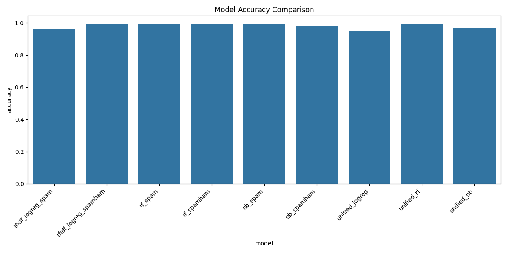
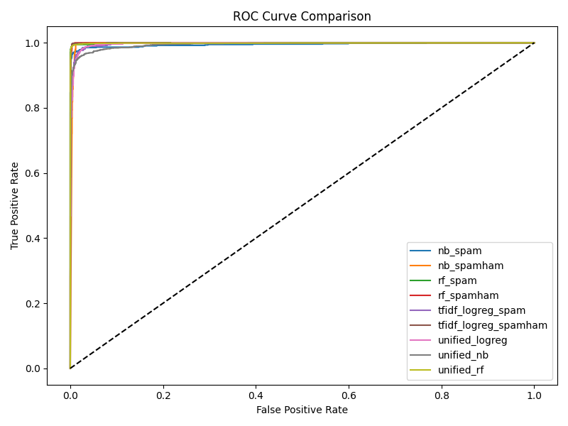
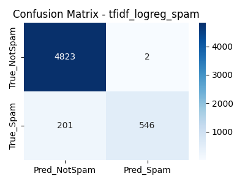
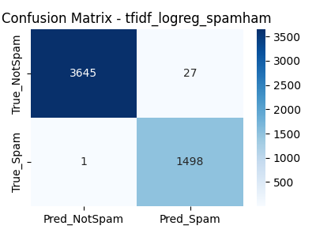
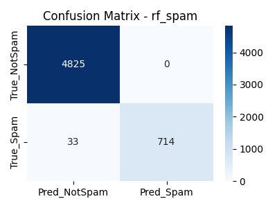
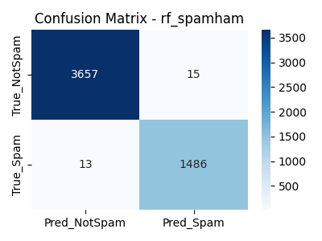
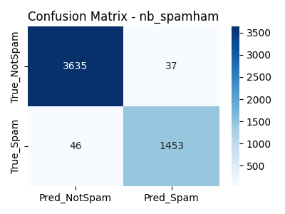
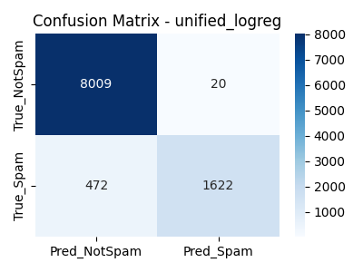
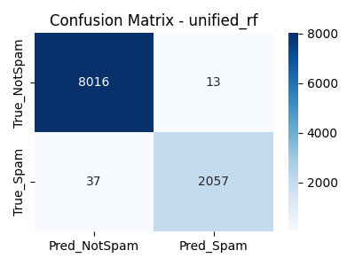
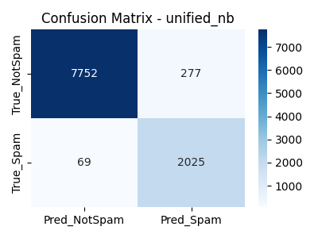

# Model Comparison Report

Generated automatically.

## Summary Table

| model                | dataset                       |   accuracy |      auc |
|:---------------------|:------------------------------|-----------:|---------:|
| tfidf_logreg_spam    | data/spam.csv                 |   0.963568 | 0.997033 |
| tfidf_logreg_spamham | data/spam_ham_dataset.csv     |   0.994585 | 0.999644 |
| rf_spam              | data/spam.csv                 |   0.994078 | 0.999473 |
| rf_spamham           | data/spam_ham_dataset.csv     |   0.994585 | 0.999646 |
| nb_spam              | data/spam.csv                 |   0.990668 | 0.994752 |
| nb_spamham           | data/spam_ham_dataset.csv     |   0.983949 | 0.996848 |
| unified_logreg       | data/unified_spam_dataset.csv |   0.951398 | 0.996604 |
| unified_rf           | data/unified_spam_dataset.csv |   0.995061 | 0.999034 |
| unified_nb           | data/unified_spam_dataset.csv |   0.96582  | 0.994207 |

## Accuracy Comparison

## ROC Curves

## Confusion Matrices Per Model

### tfidf_logreg_spam

### tfidf_logreg_spamham

### rf_spam

### rf_spamham

### nb_spam

### nb_spamham

### unified_logreg

### unified_rf

### unified_nb

